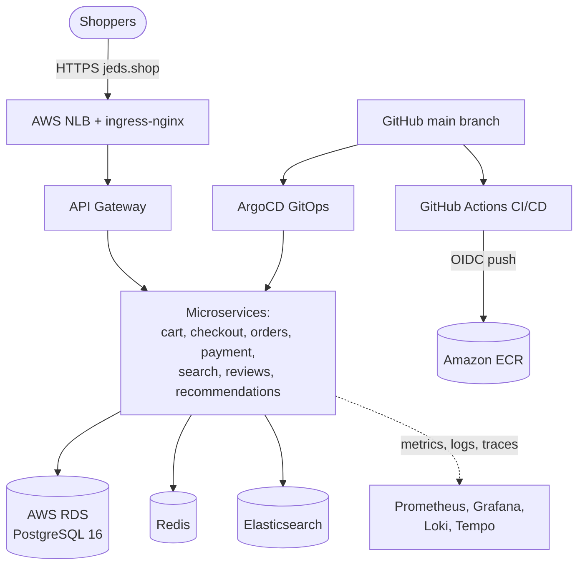

<h1 align="center">🛒 Cloud-Native E-Commerce Platform</h1>

<p align="center">
  A microservices e-commerce application running on <b>Amazon EKS (Kubernetes)</b> — with Infrastructure as Code, automated CI/CD, GitOps delivery, full observability, and a managed, encrypted <b>AWS RDS PostgreSQL</b> database.
</p>

<p align="center">
  
  
  
  
  
  
  
  
  
  
  
  
</p>

---

## 📖 Overview

A complete online-store backend — browse and search products, register and sign in, build a cart, check out and pay, track orders and shipments, leave reviews, and receive recommendations. It is built as a set of independent **microservices** and deployed to a managed **Kubernetes** cluster on **AWS**, following real production practices end to end: infrastructure as code, automated build/test/deploy pipelines, GitOps, monitoring, and a managed database.

> ✅ **91 / 91 automated end-to-end tests passing** across the entire customer journey, on a live cluster — plus a concurrency test that proves the store never oversells stock under simultaneous checkouts.

---

## ✨ What This Project Demonstrates

- **Cloud-native deployment** on Amazon EKS (Kubernetes) across multiple availability zones
- **Microservices architecture** — a dozen independent services behind a single API gateway
- **Infrastructure as Code** — the entire environment provisioned by Terraform, with remote, encrypted, locked state
- **Managed database migration** — moved from a fragile in-cluster database to **AWS RDS PostgreSQL** (encrypted, automated backups, private) with **zero application code changes**
- **Secure CI/CD** — GitHub Actions with **keyless OIDC** authentication to AWS (no long-lived credentials) and container image scanning
- **GitOps delivery** — **ArgoCD** keeps the cluster continuously in sync with Git and self-heals drift
- **Full observability** — metrics, dashboards, centralized logs, distributed tracing, and alerting
- **Security by default** — private database, TLS in transit, encryption at rest, least network exposure, and generated (never committed) secrets

---

## 🛠️ Tech Stack

| Area | Technologies |
|------|--------------|
| **Language / Runtime** | Node.js (JavaScript) |
| **Architecture** | Microservices · REST · API gateway · saga-based checkout |
| **Data stores** | PostgreSQL (AWS RDS) · Redis · Elasticsearch |
| **Containers & Orchestration** | Docker · Kubernetes (Amazon EKS) |
| **Infrastructure as Code** | Terraform (remote S3 state, locking) |
| **CI/CD & GitOps** | GitHub Actions (OIDC) · ArgoCD · Amazon ECR |
| **Observability** | Prometheus · Grafana · Loki · Tempo · Alertmanager |
| **AWS Services** | EKS · RDS · VPC · ECR · NLB · Route 53 · S3 · IAM |

---

## 🏗️ Architecture



Shoppers hit the storefront over HTTPS; an AWS load balancer and ingress controller route to the **API gateway**, which fans out to the microservices. Services read and write a managed **RDS PostgreSQL** database, with **Redis** for caching and **Elasticsearch** for product search. Code merged to `main` is built and pushed to **ECR** by GitHub Actions, and **ArgoCD** deploys it to the cluster automatically. Every service streams metrics, logs, and traces to the observability stack.

---

## 🔑 Engineering Highlights

### Managed database migration (in-cluster → AWS RDS)
Replaced a single in-cluster PostgreSQL pod (no backups, single point of failure) with a managed **AWS RDS** instance — encrypted at rest, **TLS-only** in transit, with automated backups and point-in-time recovery. The database is **private to the cluster** (its security group admits traffic only from the Kubernetes nodes — no public access), and its password is generated by Terraform and injected at deploy time, never committed. The cutover required **no application code changes** and was verified by the full 91-test suite.

### Keyless CI/CD + GitOps
GitHub Actions builds, tests, scans, and pushes images to Amazon ECR using **GitHub OIDC federation** — so there are **no static AWS keys** anywhere in the pipeline. ArgoCD then syncs the Kubernetes manifests from `main` and self-heals any drift.

### Full-stack observability
Prometheus scrapes metrics from every service; Grafana visualizes them; Loki centralizes logs and Tempo captures distributed traces. Alertmanager routes alerts (service down, high error rate, high latency, crash loops, checkout-saga failures) to Slack.

### Infrastructure as Code
A single Terraform stack provisions the whole environment — VPC, EKS, managed node group, ECR, and RDS — with **remote state in encrypted, versioned S3 and native state locking**, so it is reproducible and safe for more than one operator.

---

## 📦 Services

| Service | Responsibility |
|---------|----------------|
| `api-gateway` | Single public entry point; routing and auth boundary |
| `account` | Registration, sign-in (JWT + refresh-token rotation), profiles, addresses |
| `cart` | Cart management with server-side pricing and VAT |
| `inventory` | Stock, reservations, and oversell protection |
| `place-order` | Checkout orchestration (saga) with idempotency |
| `payment` | Payment processing |
| `order-status` | Order lifecycle and timeline |
| `shipping` | Shipment creation and tracking |
| `product-review` | Reviews, verified-purchase detection, rating summaries |
| `search` | Product catalog and full-text search (Elasticsearch) |
| `recommendation` | Related products, trending, personalized feed |
| `recommendation-generation` | Batch computation of recommendations |
| `web` | Storefront frontend |

---

## 🚀 Running It

**Prerequisites:** `aws`, `kubectl`, `helm`, `jq`, `terraform >= 1.10`; a populated `k8s/ecom-secrets.yaml`; images pushed to ECR.

```bash
# 1) Provision infrastructure (VPC, EKS, ECR, RDS) — ~20 min
cd terraform && terraform init && terraform apply

# 2) Deploy the platform to the cluster (managed-RDS mode)
bash scripts/deploy-eks.sh --use-rds

# 3) Verify end to end
API_URL=https://jeds.shop/api node scripts/e2e.mjs        # 91 functional checks
API_URL=https://jeds.shop/api node scripts/oversell.mjs   # concurrency / no oversell
```

**Teardown:** delete the ingress LoadBalancer Service *before* `terraform destroy` (so the load balancer's network interfaces release from the VPC), then `terraform destroy`.

---

## 📈 Production Roadmap

Deliberately deferred (mostly paid-tier) hardening: **Multi-AZ** RDS with automatic failover, longer backup retention, **AWS Secrets Manager** with rotation, `verify-full` TLS with the RDS CA bundle, a least-privilege application DB user, connection pooling (RDS Proxy / PgBouncer), and read replicas.

---

## 👤 Author

**[Your Name]** — _Cloud / DevOps / Backend Engineer_
🔗 [LinkedIn](https://linkedin.com/in/your-handle) · 🌐 [Portfolio](https://your-site.com) · 💻 [github.com/JyothiKumar37](https://github.com/JyothiKumar37)

> Built as a hands-on, production-style project covering the full lifecycle: microservices, containers, Kubernetes on AWS, Infrastructure as Code, CI/CD, GitOps, observability, and a managed database migration.
